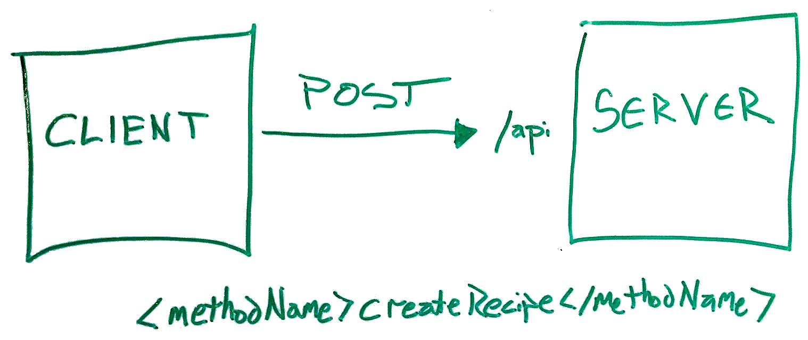
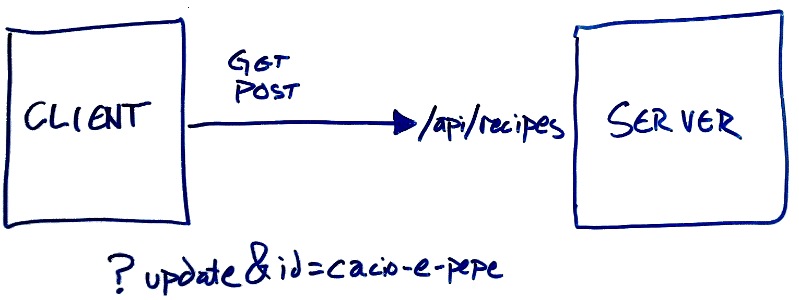
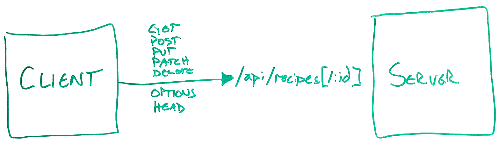

.. role:: white

Build RESTful ZF2 Applications
==============================

.. class:: titleslideinfo

    Matthew Weier O'Phinney

    @mwop

    http://www.mwop.net/

.. Change to a standard page
.. raw:: pdf

    PageBreak twoColumn

Who I am
========

Just this guy:

* Project Lead, Zend Framework
* Open Source enthusiast
* Coffee lover
* Chocolate lover
* Beer lover

.. raw:: pdf

    PageBreak titlePage

.. class:: centredtitle

What do I mean by "REST"?

.. raw:: pdf

    PageBreak standardPage

Richardson Maturity Model
=========================

http://martinfowler.com/articles/richardsonMaturityModel.html

Level 0
=======

**HTTP to tunnel RPC**

Level 1
=======

**Resources** (multiple endpoints)

Level 2
=======

**HTTP verbs**

Level 3
=======

**Hypermedia Controls**

Level 3: Hypermedia Types: Representations
==========================================

.. code-block:: javascript

    // application/vnd.recipes+json
    {
        "id": "identifier",
        "name": "Recipe name",
        "ingredients": [
            // ingredient objects
        ],
        "directions": "Directions for cooking"
    }

Level 3: Linking
================

.. code-block:: javascript

    {
        "_links": {
            "self": {
                "href": "http://example.com/api/recipes/1234"
            },
            "describedby": {
                "href": "http://example.com/api/resources/recipe"
            }
        }
        // ...
    }

.. Talk about other link use cases: pagination, linking to related resources,
.. etc.

Level 3: Embedding
==================

.. code-block:: javascript

    {
        "_embedded": {
            "addresses": [
                {
                    "_links": {"self": {
                        "href": "http://example.com/api/addresses/5678"
                    }},
                    // a representation
                }
            ]
        }
        // ... 
    }

.. raw:: pdf

    PageBreak titlePage

.. class:: centredtitle

Aside: Hypermedia Application Language

.. raw:: pdf

    PageBreak standardPage

Which media type should I use?
==============================

* Vendor-specific? *(e.g., application/vnd.myorg.recipe+json)*
* Fully generic? *(e.g., application/json)*

A happy medium: HAL
===================

**application/hal+json**

* Describes hypermedia links
* Describes how to embed resources, either as parts of other resources or parts
  of collections
* Otherwise retains your object structure

HAL: Resource
=============

.. code-block:: javascript

    {
        "_links": {
            "self": {
                "href": "http://example.com/api/recipes/cacio-e-pepe"
            }
        },
        "id": "cacio-e-pepe",
        "name": "Cacio e Pepe Pasta"
    }

.. Talk about self link as being required

HAL: Embedded resource
======================

.. code-block:: javascript

    {
        "_links": {"self": {"href": "..."}},
        "_embedded": {
            "author": {
                "_links": {"self": {"href": "..."}},
                "id": "mario",
                "name": "Mario Mario"
            }
        }
        // ...
    }

.. Note that the style is name => object, and that embedded resources
.. also have links.

HAL: Collections
================

.. code-block:: javascript

    {
        "_links": {
            "self": {"href": "..."},
            "next": {"href": "..."},
            "prev": {"href": "..."},
            "first": {"href": "..."},
            "last": {"href": "..."}
        },
        // ...
    }

.. Talk about relational links!

HAL: Collections
================

.. code-block:: javascript

    {
        // ...
        "_embedded": {
            "recipes": [
                {
                    "_links": { "self": { "href": "..." } },
                    "id": "cacio-e-pepe",
                    "name": "Cacio e Pepe Pasta"
                },
                // ...
            ]
        },
        "and-other-properties": "if desired"
    }

.. Discuss that this is the same format to use in a single resource as well,
.. when an "object" is actually a collection of objects, such as addresses.

.. raw:: pdf

    PageBreak titlePage

.. class:: centredtitle

Translating the Richardson Maturity Model to ZF2

.. raw:: pdf

    PageBreak standardPage

Areas of Concern
================

* Routing (unique URLs per resource, link generation)
* ``AbstractRestfulController`` (HTTP method negotiation)
* View Models and Renderers (media-type negotiation and resource representations)

.. raw:: pdf

    PageBreak titlePage

The easy bit: routing
=====================

.. raw:: pdf

    PageBreak standardPage

Segment routes
==============

Segment routes with an ``:id`` segment:

.. code-block:: php
    :startinline: true

    'recipe' => array(
        'type' => 'Segment',
        'options' => array(
            'route' => '/api/recipes[/:id]',
            'defaults' => array(
                'controller' => 'Recipe\ApiController',
            ),
        ),
    )

.. Note that "id" is optional here -- allowing you to get a collection by not
.. providing an identifier, or an individual recipe when you do. Also note that
.. the "/" is part of the optional segment; we want ONE canonical URL for the
.. resource collection or any individual resource. Also note the lack of a
.. "format" extension; you should have a single URI for the resource, and use
.. the Accept and Content-Type headers to communicate preferred representations.
.. 
.. Also note that "id" is by convention; AbstractRestfulController requires it
.. currently, which means that you have to extend the class to make it
.. configurable. This will likely be fixed for 2.2.0.

.. raw:: pdf

    PageBreak titlePage

Controllers
===========

.. raw:: pdf

    PageBreak standardPage

AbstractRestfulController
=========================

Extend ``Zend\Mvc\Controller\AbstractRestfulController``

* Provides a method per HTTP method, and calls them accordingly.
* Extracts the identifier from the route matches and passes it to the method,
  when available.
* Marshals data from the request and passes it to the method, when available.

Controller methods
==================

.. code-block:: php
    :startinline: true

    public function create($data); // POST to collection
    public function delete($id); // DELETE to resource
    public function deleteList(); // DELETE to collection
    public function get($id); // GET to resource
    public function getList(); // GET to collection
    public function head($id = null); // HEAD to either
    public function options(); // OPTIONS to either
    public function patch($id, $data); // PATCH to resource
    public function replaceList($data); // PUT to collection
    public function update($id, $data); // PUT to resource

.. Indicate that there are more methods; these are just those that map to HTTP
.. methods. Additionally, draw attention to the *List() methods; these are
.. variants on HTTP methods done on collections vs individual resources.
.. Finally, we chose "create" and "update" terminology early, and likely should
.. have used "post" and "put".
.. Essentially, you write your code in these methods, and return from them. What
.. you do depends on how you want to structure your API.

Options
=======

* You should tell the consumer what HTTP methods are available for a resource.
* You should *restrict* the consumer to those HTTP methods.
* Use the ``options()`` method for the first, and write an event listener for
  the second.

Example: options
================

.. code-block:: php
    :startinline: true

    protected $collectionOptions = array('GET', 'POST');
    protected $resourceOptions = array('DELETE', 'GET', 'PATCH', 'PUT');

    public function options()
    {
        if ($this->params->fromRoute('id', false)) {
            $options = $this->resourceOptions;
        } else {
            $options = $this->collectionOptions;
        }
        $response = $this->getResponse()
        $response->getHeaders()
            ->addHeaderLine('Allow', implode(',', $options));
        return $response;
    }

Example: listener (1)
=====================

.. code-block:: php
    :startinline: true

    public function setEventManager(EventManagerInterface $events)
    {
        $this->events = $events;
        // Register a listener at high priority
        $events->attach('dispatch', array($this, 'checkOptions'), 10);
    }

Example: listener (2)
=====================

.. code-block:: php
    :startinline: true

    public function checkOptions($e)
    {
        if ($this->params->fromRoute('id', false)) {
            $options = $this->resourceOptions;
        } else {
            $options = $this->collectionOptions;
        }
        if (!in_array($e->getRequest()->getMethod(), $options)) {
            return;
        }
        $response = $this->getResponse()
        $response->setStatusCode(405); // Method Not Allowed
        return $response;
    }

Example: create
===============

.. code-block:: php
    :startinline: true

    public function create($data)
    {
        // if JSON Content-Type, returns decoded data; for
        // application/x-www-form-urlencoded, returns array
        $resource = $this->myComposedService->create($data);
        $response = $this->getResponse();
        $response->setStatusCode(201) // Created
        $response->getHeaders()->addHeaderLine(
            'Location',
            $this->url('recipe', array('id', $resource->id))
        );
        return $resource; // More on this later
    }

.. The point of most of these examples is to show interaction with the request
.. and response. The most important part of any RESTful application is the
.. interaction with the HTTP protocol. Make sure you read up on it!

.. raw:: pdf

    PageBreak titlePage

Media-type negotiation
======================

.. raw:: pdf

    PageBreak standardPage

Media-type negotiation
======================

* Choose view model based on ``Accept`` header.
  (Potentially write custom view models for custom media types.)
* Potentially restrict access to specific media types.
* Return the appropriate ``Content-Type`` in the response.

AcceptableViewModelSelector
===========================

Select view model type based on Accept header.

.. code-block:: php
    :startinline: true

    $criteria = array(
        'Zend\View\Model\JsonModel' => array(
            'application/json',
            'text/json',
        ),
    );

    $viewModel = $this->acceptableViewModelSelector($criteria);
    $viewModel->setVariable('resource', $resource);

.. Usually you put the criteria in a class property. The standard
.. ViewModel will be returned if the criteria is not matched.

Use your own view model
=======================

.. code-block:: php
    :startinline: true

    $criteria = array(
        'Recipe\View\RecipeJsonModel' => array(
            'application/json',
            'text/json',
        ),
    );

.. Useful for providing your own serialization, type hinting, etc.

Raise a 406
===========

.. code-block:: php
    :startinline: true

    if (!$viewModel instanceof RecipeJsonModel) {
        $response = $this->getResponse();
        $response->setStatusCode(406); // Not Acceptable
        return $response;
    }

.. If your API shouldn't be accessed via a normal web browser, or only answers
.. to specific media types, you absolutely should do this!

Set the Content-Type
====================

.. code-block:: php
    :startinline: true

    // in a controller
    $response = $this->getResponse();
    $response->getHeaders()
        ->addHeaderLine('Content-Type', 'application/hal+json');

.. Nice. But semantically, the wrong location. Let's try something closer to the
.. view layer.

Set the Content-Type (2)
========================

.. code-block:: php
    :startinline: true

    // In a "render" listener
    function ($e) {
        $viewModel = $e->getViewModel();
        if (!$viewModel instanceof RecipeJsonModel) {
            return;
        }
        $response = $e->getResponse();
        $response->getHeaders()
            ->addHeaderLine('Content-Type', 'application/hal+json');
    }

.. Good. But not great. Let's try *in* the view layer!

Set the Content-Type (3)
========================

.. code-block:: php
    :startinline: true

    // In a "response" listener on the View object
    function ($e) {
        $viewModel = $e->getModel();
        if (!$viewModel instanceof RecipeJsonModel) {
            return;
        }
        $response = $e->getResponse();
        $response->getHeaders()
            ->addHeaderLine('Content-Type', 'application/hal+json');
    }

.. raw:: pdf

    PageBreak titlePage

Linking
=======

.. raw:: pdf

    PageBreak standardPage

Helpers and plugins
===================

* ``url()`` controller plugin and view helper
* ``serverUrl()`` view helper

Url helper
==========

.. code-block:: php
    :startinline: true

    // These examples are true of both controllers 
    // and view scripts.

    // collection:
    $this->url('recipe');

    // collection with query string:
    $this->url('recipe', array(), array('query' => true));

    // resource:
    $this->url('recipe', array('id' => $id));

ServerUrl helper
================

.. code-block:: php
    :startinline: true

    // Generates fully qualified URL (vs. just path)
    $this->serverUrl($urlGeneratedViaHelper);

.. Most API enthusiasts feel this is a best practice. It generally means
.. less work on the part of the consumer, as they do not need to know the
.. schema, hostname, and protocol past the initial call in order to traverse
.. the entire API and all resources that are linked.

.. raw:: pdf

    PageBreak titlePage

Renderers
=========

.. raw:: pdf

    PageBreak standardPage

Resource representations
========================

* The "R" in REST is for "Representational"
* The root of "representational" is "presentation"
* The View layer is where presentation is achieved

Approaches
==========

* Custom View Models
* Custom Renderers

Extending JsonModel
===================

* Provides a ``serialize()`` method, which is called by the ``JsonRenderer``
* Allows you to marshal what you want into the structure you want for the
  representation

Example: view model
===================

.. code-block:: php
    :startinline: true

    class RecipeJsonModel extends JsonModel
    {
        public function serialize()
        {
            $resource = $this->getVariable('resource');
            $representation = array(
                'id'   => $resource->getId(),
                'name' => $resource->getName(),
            );
            return Json::encode($representation);
        }
    }

.. Obviously, we'd likely want to handle collections separately, too.
.. The "con" to this approach is that generating links is harder; the view
.. models are usually instantiated inside your code or a helper, and not pulled
.. from the service manager, meaning they don't have access to the things like
.. the url() and serverUrl() view helpers.

Custom renderer
===============

* Can provide helper capabilities (e.g., for links!).
* Usually managed by the ``ServiceManager``, allowing for dependencies.
* Can alter workflow based on view models detected, or contents of view model.

Example: renderer
=================

.. code-block:: php
    :startinline: true

    class RecipeJsonRenderer implements RendererInterface
    {
        public function render($nameOrModel, $values = null)
        {
            if ($nameOrModel instanceof RecipeJsonModel) {
                $helper = $this->helpers->get('RenderRecipe');
            } elseif ($nameOrModel instanceof RecipesJsonModel) {
                $helper = $this->helpers->get('RenderRecipes');
            } else {
                throw new Exception('Cannot handle this!');
            }
            // delegate to the selected helper!
            return $helper($nameOrModel);
        }
    }

.. Define getEngine() and setResolver()!
.. Also, add a setter for the HelperPluginManager.

.. raw:: pdf

    PageBreak titlePage

.. class:: centredtitle

Recap

.. raw:: pdf

    PageBreak standardPage

Understand the Richardson Maturity Model
========================================

http://martinfowler.com/articles/richardsonMaturityModel.html

* Level 0: RPC, POX
* Level 1: Resources
* Level 2: HTTP verbs
* Level 3: Hypermedia controls

Get to know emerging REST standards
===================================

* Hypermedia Application Language
  (http://tools.ietf.org/html/draft-kelly-json-hal-05)
* Collection JSON
  (http://amundsen.com/media-types/collection/)

Understand the HTTP specification
=================================

http://www.w3.org/Protocols/rfc2616/rfc2616.html

* HTTP methods, which are idempotent, and expected response structure
* ``Accept`` and ``Content-Type`` headers, and how they relate
* HTTP response status codes

Understand ZF2's HTTP capabilities
==================================

* ``Request``, ``Response``, and ``Headers`` objects from ``Zend\Http``
* ``AcceptableViewModelSelector`` MVC controller helper and the ``Accept`` HTTP
  header

Utilize ZF2's event system
==========================

* Use event listeners to check for ``Content-Type``, HTTP method used,
  ``Accept`` header, etc., and return early for bad requests
* Use event listeners to shape the rendering cycle; use a combination of
  application and view events

Utilize ZF2's view layer
========================

* Use custom view models to "type" your responses
* Use custom view renderers to ensure you return appropriate representations
* Use existing helpers such as ``url()`` and ``serverUrl()`` to generate links
* Create new helpers for implementing link relations

Topics not covered
==================

* API versioning (hint: use custom media types and/or headers)
* Authentication/Authorization (hint: use OAuth tokens)
* XML and XML formats (hint: PHP has lots of tools for this)
* Probably tons more...

.. raw:: pdf

    PageBreak titlePage

.. class:: centredtitle

Thank You

.. class:: titleslideinfo

    @mwop

    http://www.mwop.net/

    http://framework.zend.com/
